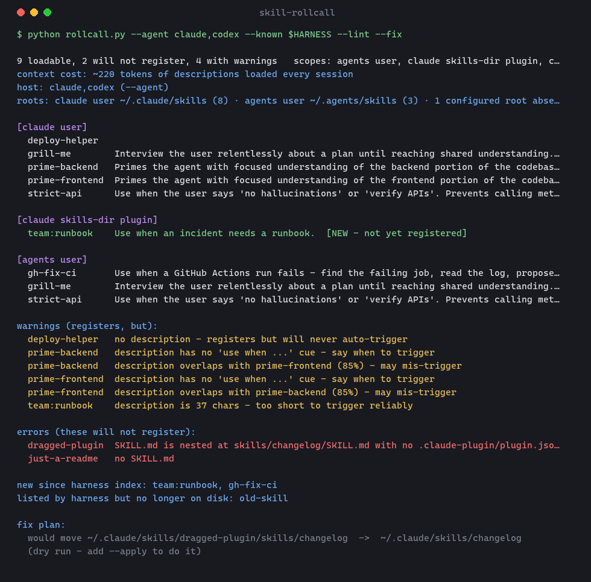

<div align="center">

# 📋 skill-rollcall

**Take a roll call of your Claude Code skills — who's here, who's new, who's never going to show up, and why.**

[](https://github.com/Londopy/skill-rollcall/actions/workflows/ci.yml)
[](LICENSE)
[](https://www.python.org/)
[](skills/skill-rollcall/scripts/rollcall.py)
[](https://code.claude.com/docs/en/plugins)
[](#install)



</div>

---

You installed a skill and the `/` picker doesn't show it. Or it shows, but never fires on its own. Or you just pulled a 300-skill repo and want to know what you actually got before Claude runs any of it. Claude Code registers skills silently and skips broken ones silently, so you're left guessing between "restart", "`/clear`", and "go read the filesystem".

`skill-rollcall` rebuilds the skill index from disk **with the reasons attached**, diffs it against what Claude currently sees, and can repair, lint or audit what it finds. It runs as a skill (`/skill-rollcall`, or just say "reload skills") and as a plain CLI.

## What it does

| Mode | Question it answers |
|---|---|
| default | Which skill folders are loadable, and which will **never register** — no `SKILL.md`, unclosed frontmatter, no `name`, a plugin dragged in whole? |
| `--known a,b,c` | Which are **registered** vs **new** since the session started, and which does Claude still list that are gone from disk? |
| `--lint` | Why doesn't it **trigger**? Missing description, no "use when…" cue, too short, near-duplicate of a sibling. Plus how many tokens all your descriptions cost every session. |
| `--fix` | Show the folder moves that would repair it. `--fix --apply` does them. Never touches the plugin cache. |
| `--audit` | Anything in these skills I should read before running them? Zero-width characters, `curl \| sh`, permission-bypass flags, injection phrasing, unfamiliar hosts, encoded blobs. |
| `--skills-dir ./skills --strict` | Is my skills **repo** clean before I publish? Non-zero exit for CI. |

Everything is read-only except `--fix --apply`, which shows you the plan first.

## Install

Pick whichever fits how you manage skills; all three produce the same result.

**`skills` CLI** (global; `--copy` because symlinks need Developer Mode on Windows):

```bash
npx skills add Londopy/skill-rollcall -g --copy
```

**Claude Code plugin** (in an interactive `claude` session):

```
/plugin marketplace add Londopy/skill-rollcall
/plugin install skill-rollcall@skill-rollcall
```

**By hand:**

```bash
git clone https://github.com/Londopy/skill-rollcall
cp -r skill-rollcall/skills/skill-rollcall ~/.claude/skills/
```

Claude Code watches the skills folders, so it shows up without a restart. Confirm with `/skill-rollcall`.

## Usage

### From Claude

Say what you'd naturally say — "reload skills", "do you see `/foo`?", "why isn't my skill triggering?", "audit the skills I just installed", "how much context are my skills eating?" — or type `/skill-rollcall`. Claude runs the right mode, answers your actual question first, then summarizes the rest. If a skill is on disk but not registered yet, Claude can load it by reading its `SKILL.md` directly, which is all the `Skill` tool does anyway.

### As a CLI

Stdlib-only Python, nothing in it depends on Claude:

```bash
python ~/.claude/skills/skill-rollcall/scripts/rollcall.py --lint
```

| Flag | Effect |
|---|---|
| `--known a,b,c` | Names the harness already lists → marks rows registered / NEW, reports stale entries |
| `--lint` | Description-quality warnings and per-session context cost |
| `--audit` | Content scan; `high` / `review` / `info` severities |
| `--fix` / `--fix --apply` | Plan / perform un-nesting and folder renames |
| `--strict` | Exit 1 on any error or `high` audit finding |
| `--skills-dir DIR` | Scan a plain `<name>/SKILL.md` folder, e.g. a repo's `skills/` |
| `--add-dir DIR` | Include `DIR/.claude/skills` |
| `--project DIR` | Start the project walk-up here (default: cwd; walks to the git root like the harness) |
| `--no-plugins` | Skip `~/.claude/plugins` |
| `--problems-only` | Findings only, no table |
| `--full` / `--json` | Untruncated descriptions / machine-readable |

Scopes it covers: `~/.claude/skills`, every `.claude/skills` from cwd up to the repo root, `--add-dir`, the plugin cache (`~/.claude/plugins/cache`, `synced`), and skills-directory plugins (a `.claude-plugin/plugin.json` + `skills/` folder inside `~/.claude/skills`, shown as `plugin:skill`).

## What it catches

| Finding | Severity | Why it matters | Fix |
|---|---|---|---|
| No `SKILL.md` | error | Folder is ignored | Add one |
| `SKILL.md` at `skills/<x>/SKILL.md` with no manifest | error | A plugin dragged in whole; the harness looks one level deep | `--fix --apply` moves the inner folders up |
| Frontmatter missing / unclosed / no `name` | error | Unparseable → not registered | Start with `---`, close with `---`, add `name:` |
| No `description` | warning | Registers, **never auto-triggers** | Write one; it's what Claude matches on |
| `name` ≠ folder | warning | Slash command uses `name`; confusing | `--fix --apply` renames the folder |
| Duplicate name across scopes | warning | One silently wins | Rename or remove one |
| `--lint`: short / no cue / overlap / heavy | warning | The structural reasons a skill under-triggers or over-triggers | Reword the description |
| `--audit`: hidden Unicode, `curl \| sh`, permission bypass | high | Classic ways a skill hides or escalates | Read the file before running the skill |
| `--audit`: injection phrasing, encoded blobs | review | Normal inside a security skill's signature table; suspicious elsewhere | Read in context |
| `--audit`: unfamiliar host | info | Where the skill phones | Decide if you expect it |

The same layout the tool flags as an error — `skills/<name>/SKILL.md` — is the correct layout for a **plugin**, which is what this repo is. Add a `.claude-plugin/plugin.json` and it's valid; drop the whole repo into `~/.claude/skills` without one and the tool will tell you to move the inner folder up. It diagnoses its own most likely mis-install.

## Related, not overlapping

`/skill-doctor` (Claude Code 2.1.252+) tells you what each skill **costs** and how often it's **used**, so you can decide what to turn off. It doesn't say why a skill failed to register or trigger. Use both: `/skill-doctor` for pruning, `skill-rollcall` for "why isn't it there". The context-cost line here is a rough stand-in when `/skill-doctor` isn't available (Remote Control sessions, older versions).

## What it cannot do

- **It can't make the harness rescan.** Claude Code watches the skills folders itself and picks up adds, edits and removals in-session — except in `--bare` mode. This tool tells you whether that's happened and works around it when it hasn't.
- **`--lint` is structural, not semantic.** It catches the description shapes that reliably under-trigger. It doesn't predict whether a given phrase will fire a given skill.
- **`--audit` is a pattern scan, not a verdict.** Clean means nothing obvious turned up, not that the skill is safe. Read anything it flags `high`.
- **Plugin `hooks/`, `agents/` and `.mcp.json` changes** need `/reload-plugins`; SKILL.md text doesn't.
- **The desktop app's `/` picker is a separate cache.** In a session opened before you installed a skill, the app may say "`/skill-rollcall` isn't a command here" even though Claude already has it. Send the request as a normal message instead ("roll call my skills") — that goes to Claude, not the picker. Don't `/clear` a long session just for this.

## Development

```bash
python -m unittest discover -s tests -v          # 44 tests, stdlib only
python skills/skill-rollcall/scripts/rollcall.py --skills-dir skills --lint --audit --strict
python docs/make_demo.py                         # re-render docs/demo.png (needs Pillow)
```

CI runs the tests on Windows, macOS and Linux across Python 3.10 and 3.13, then runs the tool on its own skill in strict mode — so the auditor audits itself on every push.

## Layout

```
skill-rollcall/
├── .claude-plugin/
│   ├── plugin.json          # plugin manifest
│   └── marketplace.json     # the repo is its own single-plugin marketplace
├── skills/skill-rollcall/
│   ├── SKILL.md             # what Claude reads
│   └── scripts/rollcall.py  # the tool (stdlib only, Python 3.10+)
├── tests/test_rollcall.py
├── docs/                    # demo image + generator
└── .github/workflows/ci.yml
```

## License

[MIT](LICENSE) © 2026 Londopy
